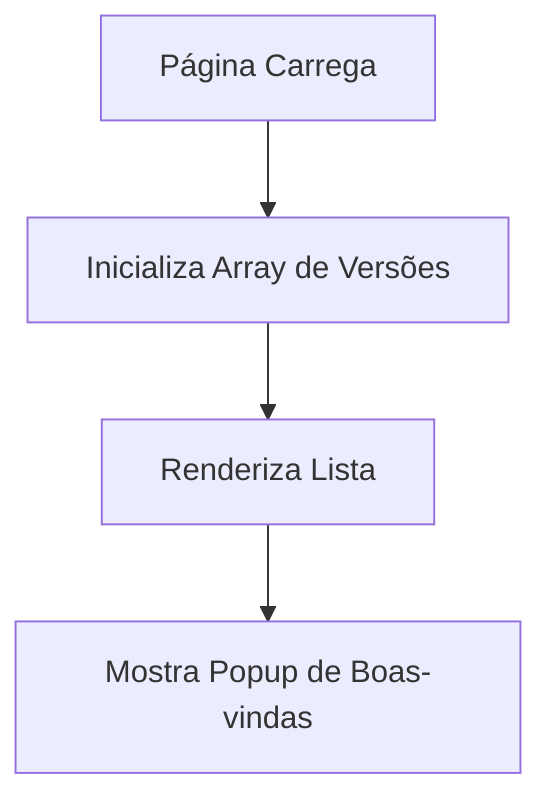
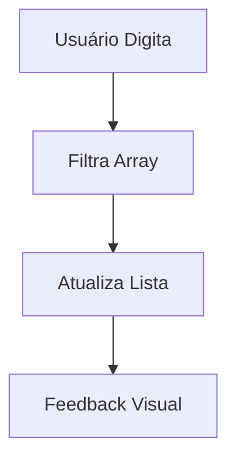
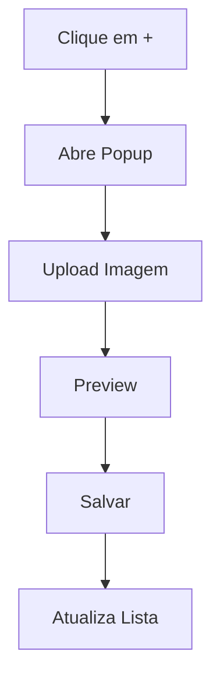

# Bíblia Online - Documentação Completa

## Visão Geral

Este projeto é uma aplicação web interativa para leitura da Bíblia Sagrada, com foco em experiência amigável, intuitiva e completa. Desenvolvido em HTML5, CSS3 e JavaScript puro, sem frameworks, para exercitar e fixar o aprendizado.

O objetivo é oferecer uma ferramenta online acessível para leitura e estudo da Bíblia, além de conteúdos complementares como Harpa Cristã, Hinário Batista, Dicionário Bíblico e Concordância. O sistema permite navegação intuitiva entre livros, capítulos e versículos, além de recursos como projeção de versículos (slide), download, utilidades e busca avançada.

## Estrutura do Projeto

```
biblia/
├── index.html          # Página principal
├── style.css           # Estilos gerais
├── script.js           # Lógica principal
├── img/                # Imagens
├── html/               # Páginas das versões
├── baixar/             # Downloads de versões
├── arc/ ara/ nvi/      # Estrutura por versão/livro/capítulo
├── harpa_cantor/       # Hinos e cantos
├── js/                 # Scripts por versão
├── css/                # Estilos por versão
├── README.md           # Documentação resumida
├── documentacao.md     # Documentação técnica
└── projeto.md          # Documentação completa
```

## Componentes e Funcionalidades

- **Interface Principal:** Lista de versões, busca em tempo real, popups interativos, design responsivo.
- **Cards de Versões:** Exibição de imagens e títulos, layout responsivo, efeitos visuais.
- **Popups:** Boas-vindas, adicionar nova versão, overlays.
- **Busca:** Filtragem em tempo real, feedback visual.
- **Upload de Imagens:** Preview, validação, base64.
- **Slide para Datashow:** Projeção de versículos, navegação simplificada, otimização para tela cheia.
- **Dicionário e Concordância:** Busca de termos, referências bíblicas, filtros.
- **Download:** Vários formatos, verificação de disponibilidade.
- **Utilitários:** Conversão de referências, formatação, estatísticas.

## Estrutura de Dados e Lógica

```javascript
// Exemplo de array de versões
const bibleVersions = [
    { titleAnime: 'Bíblia ACF', img: './img/acf.png' },
    { titleAnime: 'Bíblia ARA', img: './img/ara.png' },
    // ... outras versões
];

// Busca
function barraPesquisa() {
    const searchTerm = inputUserFilter.value.toLowerCase();
    const filteredVersions = bibleVersions.filter(version => 
        version.titleAnime.toLowerCase().includes(searchTerm)
    );
    // Renderiza resultados
}
```

## Fluxo de Dados

### Carregamento Inicial


### Busca de Versões


### Adição de Nova Versão


## Recursos Adicionais

### Slide para Datashow
- Apresentação imersiva em tela cheia
- Navegação entre versículos
- Layout otimizado para projeção

### Dicionário Bíblico
- Busca de termos
- Adição e cache de definições

### Concordância Bíblica
- Busca por palavras
- Geração de índice e referências

### Download
- Vários formatos (PDF, EPUB, MOBI)
- Verificação de disponibilidade

### Utilitários
- Conversão de referências
- Formatação de texto
- Estatísticas

## Interface dos Recursos

```html
<!-- Slide -->
<div class="slide-container">
    <div class="slide-content"></div>
    <div class="slide-controls">
        <button class="prev">Anterior</button>
        <button class="next">Próximo</button>
    </div>
</div>

<!-- Dicionário -->
<div class="dicionario-container">
    <input type="text" class="busca-termo">
    <div class="resultado-termo"></div>
</div>

<!-- Concordância -->
<div class="concordancia-container">
    <input type="text" class="busca-palavra">
    <div class="resultados-concordancia"></div>
</div>
```

## Estilos e Responsividade

```css
/* Exemplo de responsividade */
@media (max-width: 768px) {
    .lista-versoes { flex-direction: column; }
}
@media (min-width: 769px) and (max-width: 1024px) {
    .lista-versoes { grid-template-columns: repeat(2, 1fr); }
}
```

## Segurança e Performance

- Validação de inputs e sanitização de dados
- Proteção contra XSS
- Otimização de imagens e lazy loading
- Cache temporário

## Instruções de Uso

1. **Clonar o Repositório:**
    ```bash
    git clone https://github.com/seu-usuario/seu-repositorio.git
    ```
2. **Abrir o Projeto:**
   - Use seu editor de código preferido (ex: VS Code)
3. **Estrutura de Arquivos:**
   - `index.html`, `style.css`, `script.js`, pastas de versões, imagens, etc.

## Próximos Passos

- Implementar persistência de dados
- Adicionar mais versões
- Melhorar acessibilidade
- Otimizar performance
- Adicionar testes automatizados

## Créditos e Licença

- Projeto desenvolvido por [Seu Nome]
- Licença: MIT

---

*Este arquivo reúne e organiza todas as informações do README.md e documentacao.md, removendo duplicidades e mantendo apenas uma versão de cada explicação.* 